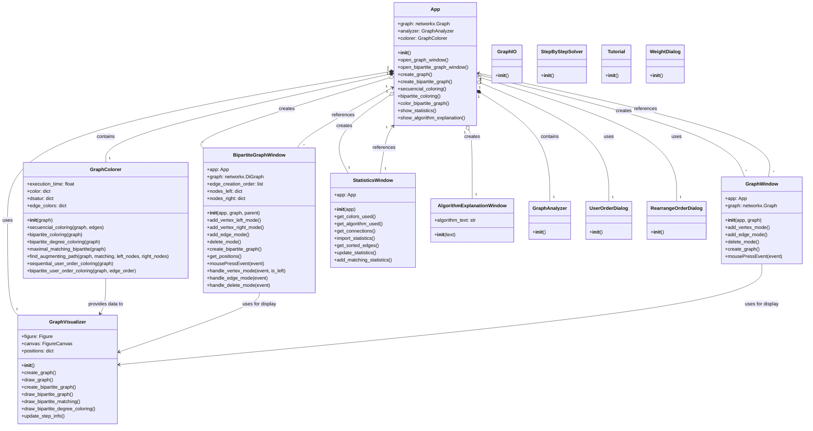

# PyAlgGraph Class Diagram

The class diagram shows the main architectural components of the PyAlgGraph application and how they relate to each other. The key classes are:

- **App**: Central controller class that manages the application flow
- **GraphColorer**: Handles graph coloring algorithms
- **GraphVisualizer**: Manages the visual representation of graphs
- **BipartiteGraphWindow** and **GraphWindow**: UI components for graph creation
- **StatisticsWindow**: Displays coloring statistics
- **AlgorithmExplanationWindow**: Shows algorithm explanations

The relationships shown include:
- Composition relationships (solid diamond)
- Association relationships (arrow)
- Multiplicity (1, *, 1..*) 