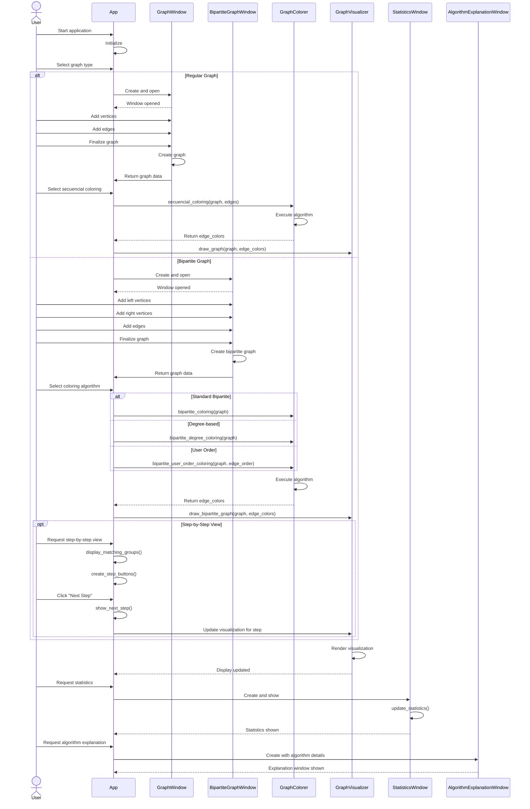

# PyAlgGraph Combined Sequence Diagram

This comprehensive sequence diagram illustrates both the regular graph and bipartite graph workflows in a single diagram, showing how the application handles both paths. The diagram uses "alt" and "else" sections to represent the branching paths, and includes:

1. Initial application setup
2. User selecting between regular and bipartite graph types
3. Different graph creation processes for each type
4. Different coloring algorithms for each type
5. Common visualization, statistics, and explanation components

For the bipartite path, it also shows the three different coloring algorithm options and the optional step-by-step visualization feature.

The arrows indicate the direction of function calls and information flow, with solid arrows representing function calls and dashed arrows representing returns or responses. 