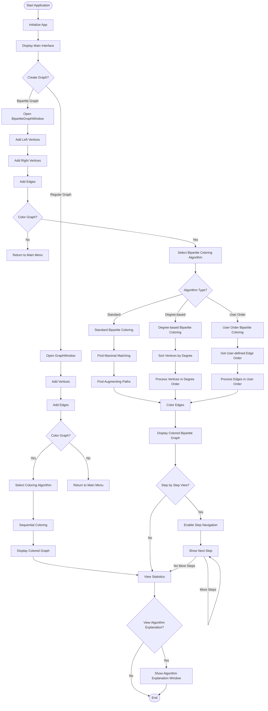

# PyAlgGraph Algorithmic Flowchart

This flowchart illustrates the algorithmic flow of the PyAlgGraph application, showing:

1. Application initialization
2. Main flow branches for regular graphs vs. bipartite graphs
3. The graph creation process
4. Different coloring algorithms:
   - Sequential coloring for regular graphs
   - Standard bipartite coloring
   - Degree-based bipartite coloring
   - User-order bipartite coloring
5. Step-by-step visualization option
6. Statistics and explanation display

The diamond shapes represent decision points, while rectangles show processes or operations. The rounded rectangles indicate the start and end points of the application flow. 