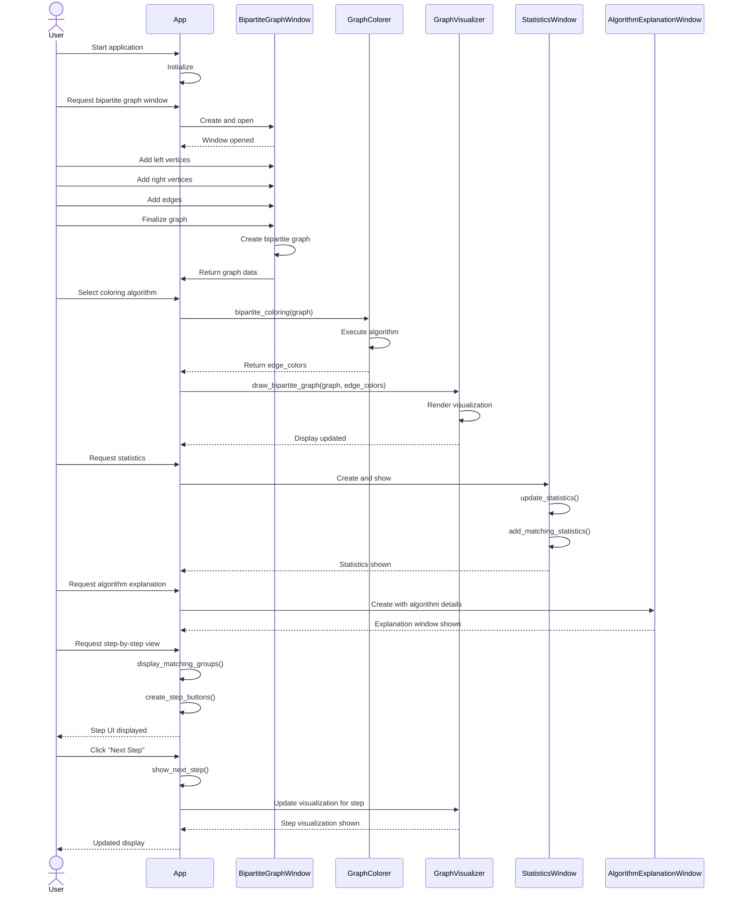

# PyAlgGraph Sequence Diagram

This sequence diagram illustrates the interaction flow between the main components during a typical operation of creating and coloring a bipartite graph. It shows:

1. Initial application setup
2. Creating a bipartite graph through the BipartiteGraphWindow
3. Coloring the graph using GraphColorer
4. Visualizing the colored graph with GraphVisualizer
5. Displaying statistics through StatisticsWindow
6. Showing algorithm explanations via AlgorithmExplanationWindow
7. The optional step-by-step navigation flow

The arrows indicate the direction of function calls and information flow, with solid arrows representing function calls and dashed arrows representing returns or responses. 