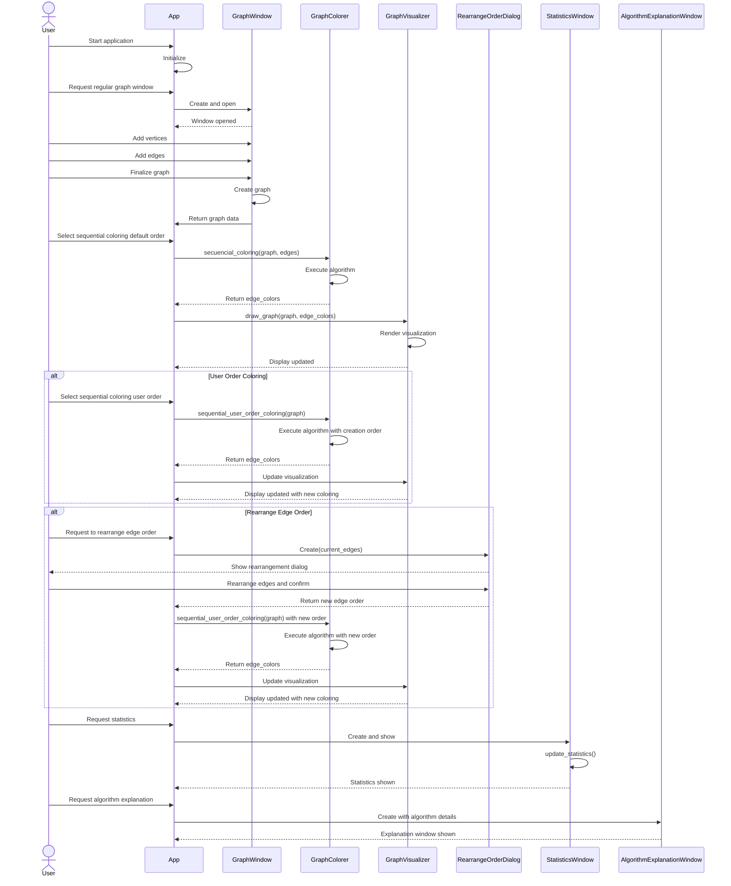

# PyAlgGraph Regular Graph Sequence Diagram

This sequence diagram illustrates the interaction flow between the main components during a typical operation of creating and coloring a regular graph. It shows:

1. Initial application setup
2. Creating a regular graph through the GraphWindow
3. Default sequential coloring with degree-based ordering
4. Optional user order coloring based on creation/user-specified order
5. Optional rearrangement of edge order through the RearrangeOrderDialog
6. Visualizing the colored graph with GraphVisualizer
7. Displaying statistics through StatisticsWindow
8. Showing algorithm explanations via AlgorithmExplanationWindow

The arrows indicate the direction of function calls and information flow, with solid arrows representing function calls and dashed arrows representing returns or responses. 